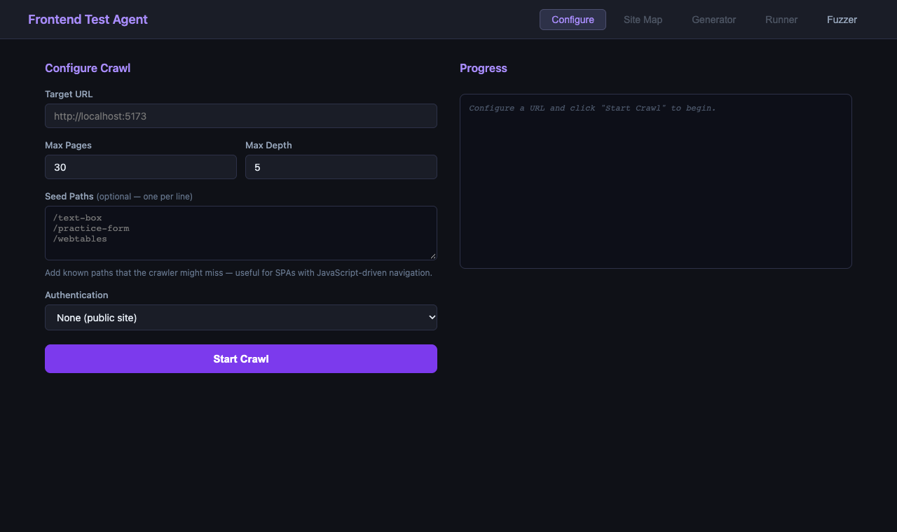

# frontend-test-agent

An automated characterization test generator for web frontends. Point it at any site, and it crawls the UI, uses an LLM to generate Playwright test cases and spec files, runs them, and fuzzes forms and API endpoints — all without writing a single test by hand.

> **Characterization testing** means recording what the app *currently does*, not asserting what it *should* do. Tests never fail intentionally — they observe and report.



---

## How it works

Four stages, each a plain npm script:

```
crawler/   →  npm run crawl          Playwright crawl — no LLM, writes raw JSON per page
generator/ →  npm run generate       LLM groups pages into features, writes test cases + Playwright specs
runner/    →  npm run run-tests      Runs the generated specs, writes results.json
             npm run report          LLM analyses results, writes bug_report.md
fuzzer/    →  npm run fuzz           API/path fuzz with boundary inputs
             npm run fuzz-frontend   Form fuzz with boundary/edge-case inputs
```

Each stage writes files the next stage reads — so you can inspect intermediate output at any point.

---

## Setup

```bash
npm install
npx playwright install chromium
cp .env.example .env   # then add your real API key
```

Set your LLM provider in `.env`:

```
LLM_PROVIDER=claude       # or: openai, gemini
ANTHROPIC_API_KEY=sk-...
# OPENAI_API_KEY=sk-...
# GEMINI_API_KEY=...
```

Only `npm run generate` and `npm run report` need a key. The crawler, runner, and fuzzer work without one.

---

## Configure

Edit `config.js` before crawling:

```js
export default {
  baseURL: "https://your-site.com",
  crawl: {
    maxPages: 30,   // raise to 60+ for sites with many category pages
    maxDepth: 5,
    waitAfterAction: 500,
    seedPaths: []   // add known deep paths to ensure they get crawled
  },
  auth: { type: "none" },
  output: {
    rawDir: "tests/generated/site-maps/raw",
    summaryFile: "tests/generated/site-maps/crawl-summary.json"
  }
};
```

Or use the UI (`npm run server`, then open `http://localhost:3001`) to configure and run the pipeline visually.

> **BFS trap:** the crawler visits breadth-first from `/`. On sites with a large flat nav (e.g. 50 sidebar categories), `maxPages` gets consumed by depth-1 pages before any detail pages are reached. Either raise `maxPages`, or add known deep-page paths to `seedPaths`.

---

## Run

Full pipeline:

```bash
npm run crawl && npm run generate && npm run run-tests && npm run report && npm run fuzz && npm run fuzz-frontend
```

Or step by step to inspect output between stages:

```bash
npm run crawl          # → tests/generated/site-maps/raw/*.json
npm run generate       # → tests/generated/specs/*.spec.js
npm run run-tests      # → tests/generated/reports/results.json
npm run report         # → tests/generated/reports/bug_report.md
npm run fuzz           # → tests/generated/fuzz/reports/fuzz_results.json
npm run fuzz-frontend  # → tests/generated/fuzz/reports/fuzz_form_results.json
```

Dry-run mode (prints prompts, makes no LLM calls):

```bash
npm run generate:dry
npm run interpret:dry
```

---

## Output

```
tests/generated/
  site-maps/raw/          Raw crawl data — one JSON per page
  site-maps/site_map.json Interpreted site map with inferred purposes + workflows
  test-cases/*.json       Generated test case definitions
  test-data/*.json        Generated test input data
  specs/*.spec.js         Generated Playwright spec files
  reports/results.json    Test run results
  reports/bug_report.md   LLM-generated bug report
  fuzz/reports/           API fuzz results + report
  improved/               Auto-improved specs for failing tests
```

---

## LLM providers

| Provider | Model | Env var |
|---|---|---|
| Claude (default) | claude-sonnet-4-6 | `ANTHROPIC_API_KEY` |
| OpenAI | gpt-4o-mini | `OPENAI_API_KEY` |
| Gemini | gemini-2.0-flash | `GEMINI_API_KEY` |

All providers are called with `temperature: 0` for deterministic output.

---

## Project structure

```
crawler/      Playwright-based site crawler
generator/    LLM-powered test case + spec generator
  llm.js      Single LLM call entrypoint (Claude / OpenAI / Gemini)
  grouper.js  Groups crawled pages into features
  cases.js    Generates test case definitions per feature
  specs.js    Generates Playwright spec files
  data.js     Generates test input data from crawl schemas
  improver.js Rewrites failing tests based on error type
runner/       Runs generated specs, writes results
fuzzer/       API + form fuzzer with boundary/edge-case inputs
server/       Express API for the UI
ui/           React dashboard (Vite)
```
